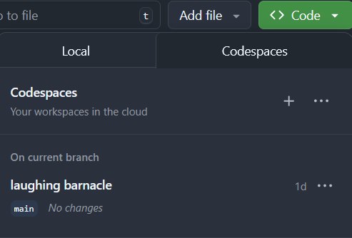

[gh-troubleshoot-ssh-keys-conf]: https://docs.github.com/authentication/troubleshooting-ssh
[claude-pricing]: https://claude.com/pricing
[owasp-wstg]: https://owasp.org/www-project-web-security-testing-guide/
[owasp-asvs]: https://owasp.org/www-project-application-security-verification-standard/


# Prerequisites

- GitHub account — a free account works.
- Claude subscription — a Pro is needed, you can get one at [Claude Pricing][claude-pricing].
- Git Bash or WSL2 — only if you are planning to [Run the lab locally](#run-locally)

# Setup

We'll go over two different exercises where we'll work together with Claude Code to perform quality-related tasks; the exercises can be carried out locally on your machine or in _GitHub Codespaces_.

## 1. Fork the Repository

You'll work on your own fork of this repository. To get started, locate the Fork button at the top of the repository page, next to _Watch_ and _Star_.


1. Click the **Fork** button.
2. Make sure your user is selected in the _Owner_ drop-down.
3. Provide a name for the repository or leave it as-is.

You may now browse to the new repository under your account.

Once you have your fork ready, proceed to [Run in Codespaces](#run-in-codespaces) or [Run Locally](#run-locally) which are the two choices to setup your environment.

## Run in Codespaces

GitHub Codespaces gives you a ready-to-use development environment in your browser — no local installation needed. This is the recommended path if you are not familiar with local development setup.

### 2. Open the Repository in Codespaces

Once you are on the front page of your forked repository:

1. Click the green **Code** button — a palette will pop up.
2. Select the **Codespaces** tab, then click **Create codespace on main**.



A new tab will open while your codespace is being set up. Wait for it to finish — you should then see an editor with the file tree on the left side.

### 3. Install Claude Code

Once your codespace is up and running, install the Claude Code extension:

1. Open the Extensions sidebar (_Ctrl+Shift+X_).
2. Search for **Claude Code**.
3. Click **Install**.

### 4. Authenticate

If the Claude Code tab is not visible yet, open the command palette with _Ctrl+Shift+P_ and select **Claude > Open in New Tab**.

Select the option to authenticate with a Claude subscription and use your account to sign in.

>Dismiss the dialog that pops up by hitting "Cancel" and copy the URL provided in the Claude tab, copy and paste in your browser to authenticate and follow the instructions shown in the page to finish up.

You are all set — jump straight to the [Exercises](#exercises) section.

---

## Run Locally

Use this path if you prefer to work on your own machine. You will need:

- VS Code (extensions may vary)
- Your preferred terminal emulator
- Git

### 2. Set Up Access to GitHub

You need a way to authenticate with GitHub to clone your repository. Pick **one** of the two options below.

#### Option A — SSH Keys

SSH keys are the most common method. If you have already set up SSH keys for GitHub you can skip ahead to [clone the repository](#3-clone-the-repository).

**Generate a new SSH key:**

```bash
ssh-keygen -t ed25519 -C "your_email@example.com"
```

Accept the default file location by pressing _Enter_, and optionally set a passphrase.

**Copy the public key to your clipboard:**

```bash
# macOS
cat ~/.ssh/id_ed25519.pub | pbcopy

# Linux
cat ~/.ssh/id_ed25519.pub | xclip -selection clipboard

# Windows (Git Bash or WSL)
cat ~/.ssh/id_ed25519.pub | clip
```

**Add the key to GitHub:**

1. Go to **GitHub → Settings → SSH and GPG keys**.
2. Click **New SSH key**, paste the key, and save.

If you run into any issues, refer to the [SSH troubleshooting guide][gh-troubleshoot-ssh-keys-conf].

---

#### Option B — GitHub CLI

The GitHub CLI (`gh`) handles authentication and cloning without needing to manage SSH keys manually.

**Install the GitHub CLI:**

```bash
# macOS
brew install gh

# Windows (winget)
winget install --id GitHub.cli

# Ubuntu / Debian
sudo apt update && sudo apt install gh

# Fedora / RHEL
sudo dnf install gh
```

**Authenticate:**

```bash
gh auth login
```

Follow the interactive prompts — select **GitHub.com**, choose **HTTPS** as the preferred protocol, and authenticate via browser when asked.

---

### 3. Clone the Repository

Once you are on the front page of your forked repository, click the green **Code** button and copy the URL shown, then run one of the commands below depending on the method you chose in the previous step.

**SSH:**

```bash
git clone git@github.com:YOUR_USERNAME/REPO_NAME.git
```

**HTTPS:**

```bash
git clone https://github.com/YOUR_USERNAME/REPO_NAME.git
```

**GitHub CLI:**

```bash
gh repo clone YOUR_USERNAME/REPO_NAME
```

Replace `YOUR_USERNAME` and `REPO_NAME` with the values from your forked repository URL.

### 4. Install Claude Code

Claude Code is distributed as an npm package, so you'll need **Node.js 18 or later** installed first.

**Install Node.js (if not already installed):**

```bash
# macOS
brew install node

# Windows (winget)
winget install OpenJS.NodeJS

# Ubuntu / Debian
sudo apt update && sudo apt install nodejs npm

# Fedora / RHEL
sudo dnf install nodejs npm
```

**Install the Claude Code CLI:**

```bash
npm install -g @anthropic-ai/claude-code
```

**Confirm the installation worked:**

```bash
claude --version
```

**Install the VS Code extension (optional but recommended):**

```bash
code --install-extension anthropic.claude-code
```

### 5. Authenticate

Open a terminal, navigate to the directory where you cloned the repository, and run:

```bash
claude
```

Select the option to authenticate with a Claude subscription and use your account to sign in.

# Exercises

The following exercises are developed around a fictitious patient journal system which we are going to co-develop with Claude from the ground up, from requirements to development and testing.

Under each application directory for both examples, there is a *prompts* directory with example of prompts for Claude to carry out the tasks.

## E1 - Procure Security Requirements

The file `patient_journal_api/README.md` contains a basic description of the application, functional requirements, details of the planned infrastructure and it stack. The goal is to have Claude read the app description and complement it with security requirements considerations, using [OWASP ASVS][owasp-asvs] as the base/source catalog of security requirements.

Generate an initial threat model using the STRIDE method for the application.

## E2 - Address Weaknesses in Application Code, CI/CD and Application Infrastructure

We have a second application in `malware_analysis_api` with an existing implementation that we need to take a look at to:

- Find weaknesses and vulnerabilities in the existing application code
- Review security configuration in the CI/CD pipelines
- Review the terraform project to get suggestions
- Add security testing according to [OWASP Web Security Testing Guide][owasp-wstg]

Ensure this runs as *Plan Mode*.
